# Connect with Google Spreadsheet

If you use Voiceflow's Google spreadsheet link function, you can use it as a simple database that can be used with the same ease of use as your usual Excel, so the range of skill development will expand at a stretch. Let's make use of it to create higher-grade skills.

## Randomly call spreadsheet data

First, let's do some random data extraction from the sheet while learning the basics of using Voiceflow with Google spreadsheets. As a sample, let's create a skill that will randomly tell you the recommended recipes and their ingredients registered in Google Spreadsheet.

### Creating a spreadsheet and basic skills

First, log in to Google Spreadsheets with your Google account and create a spreadsheet like the one below.


- The spreadsheet name is "My recipe data" and the sheet name (tab below) is "Recipe list".
- Enter ```recipe_name``` for A1 and``` recipe_content``` for B1. The first line is always the heading line. Please note that you cannot specify in Japanese.
- In the second and subsequent rows, enter the recipe name in column A and the ingredients in column B.

Next, create the following project on the Voiceflow side and place the blocks.


- The project name will be “My home recipe”. Select only the language "Japanese (ja-JP)".
- Once the project is created, place one Speak block and connect it with the Start of the Home block with a line.
- Set the Speak block as follows.

// list [] [] {
Welcome to our recipe skills. This skill will teach you a random recipe. Today ’s recommendation is <audio src = "soundbank: // soundlibrary / ui / gameshow / amzn \ _ui \ _sfx \ _gameshow \ _intro \ _01" />
//}

By the way, the last ```<audio src = ~``` part uses "Alexa Skills Kit sound library" to play sound effects.

// note [Alexa Skills Kit sound library] {
@ <href> {https://developer.amazon.com/ja-JP/docs/alexa/custom-skills/ask-soundlibrary.html}
//}

//embed[latex]{
\clearpage
//}

### "Integration block" that links with Google Spreadsheet

The integration with Google Spreadsheet uses "Integration block". From the Advanced in the Blocks menu on the left, drag and drop the Integration block to the right of the Speak block and connect it with a line.

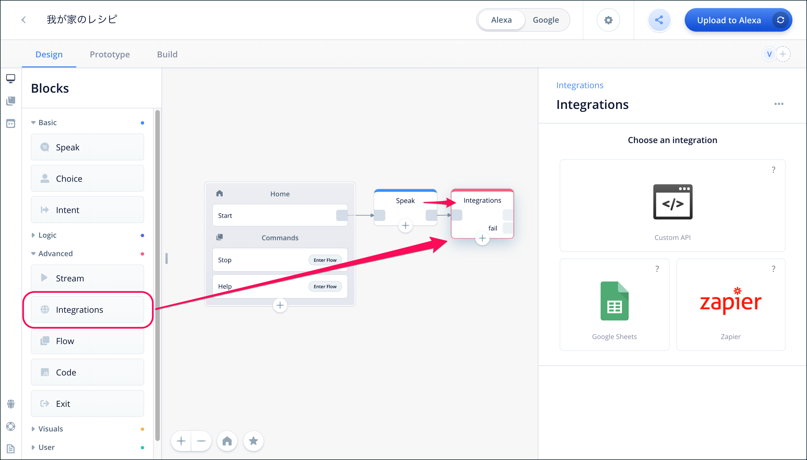

Click "Google Sheets" (Google Sheets is called Google Sheets in English) in the settings of the Integration block displayed on the right.

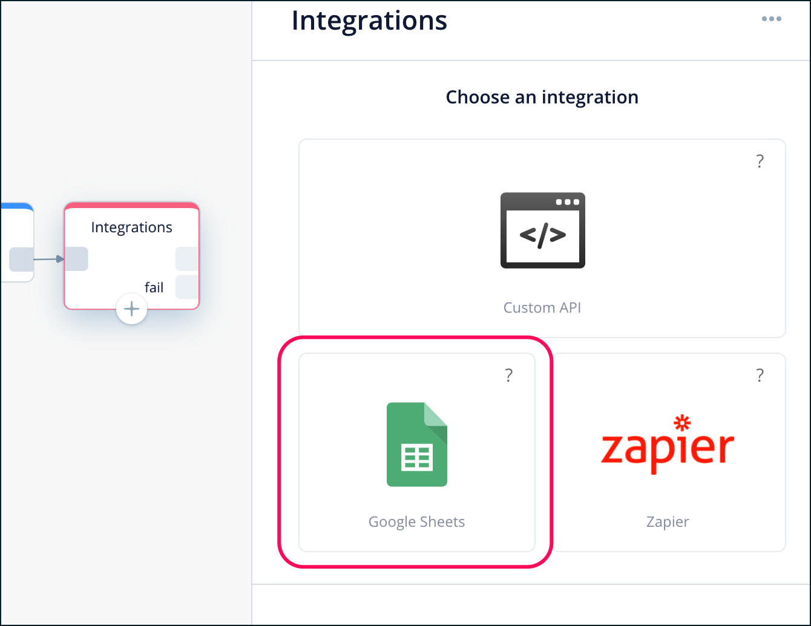

//embed[latex]{
\clearpage
//}

First, select what you want to do with your spreadsheet data. Retrieve Data (read data from spreadsheet) / Create Data (add one row of data to spreadsheet) / Update Data (update one row of data in spreadsheet) / Delete Data (delete data of spreadsheet) You can choose from four. This time, I want to read the data of recipe name and material name from Google spreadsheet, so click "Retrieve Data".

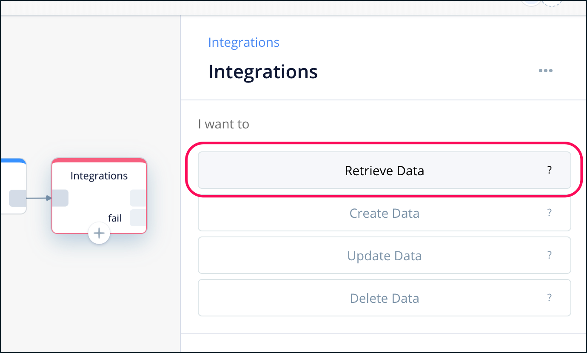

Next, link to your Google account to access Google spreadsheets. Click “+ Add User”.

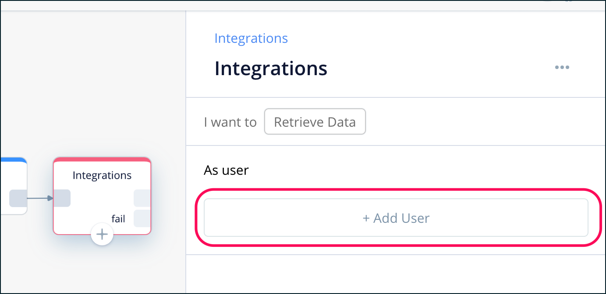

//embed[latex]{
\clearpage
//}

When you link accounts for the first time, the login screen of your Gooogle account will be displayed as follows. Click Login with Google.


The Google account selection screen will be displayed. Select the account that created the Google spreadsheet. You may be prompted to enter your account password. In that case, please log in with your Google account and password. Then "allow" access to Google Spreadsheets from Voiceflow.

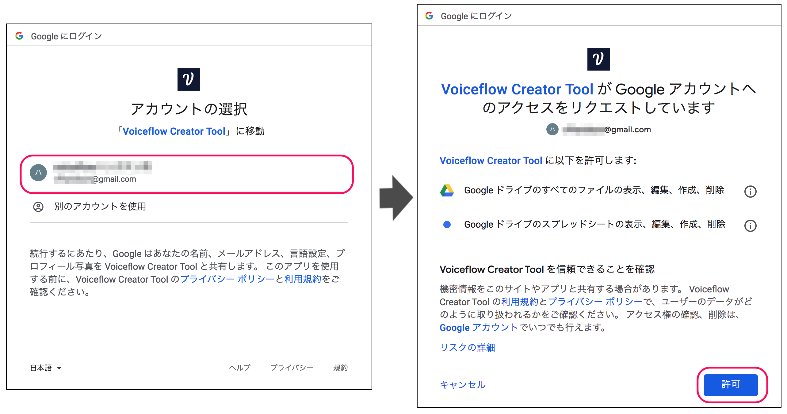

//embed[latex]{
\clearpage
//}

If it is displayed as shown below, the link with the Google account is completed. Click "Using Sheet" to continue.


In "Using Sheet", select the spreadsheet to access from Voiceflow. Select a spreadsheet name from "Spreadsheet" and a sheet name (tab name below) from "Sheet". In the case of the first spreadsheet created this time, select “My recipe data” for “Spreadsheet” and “Recipe list” for “Sheet”. (If you cannot see the sheet name, please scroll down a little.)


//embed[latex]{
\clearpage
//}

Once you have selected your spreadsheet, you will see “With Settings”. Here, the search conditions are originally specified, but in the case of random, select "Row Number" from the list in "Column" on the left, and click "Next" without entering anything in "Value to Match" on the right Click.


"Mapping Output" is also set later, so just click "Next".

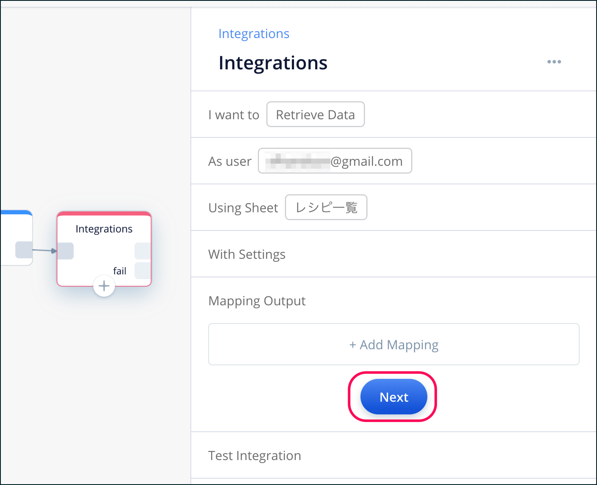

//embed[latex]{
\clearpage
//}

In "Test Integration", you can actually test the connection to Google Spreadsheet. Click "Test Integration".

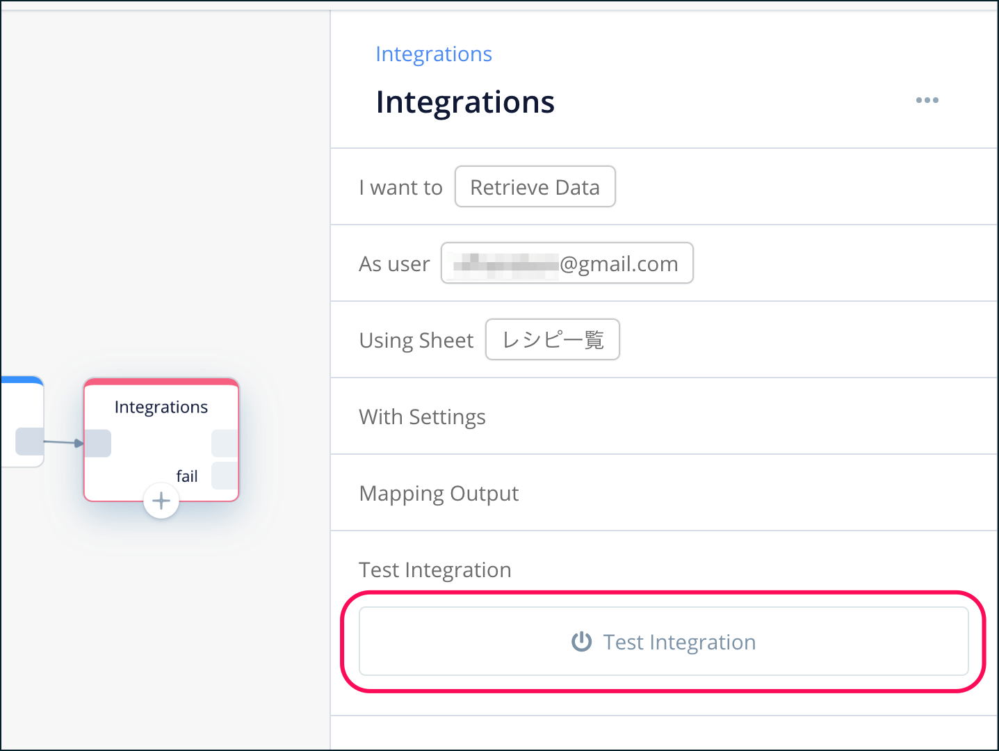

It is successful if the recipe name and ingredients listed in the spreadsheet are displayed under "Test Integration". Click Test Integration several times to see the results change randomly.

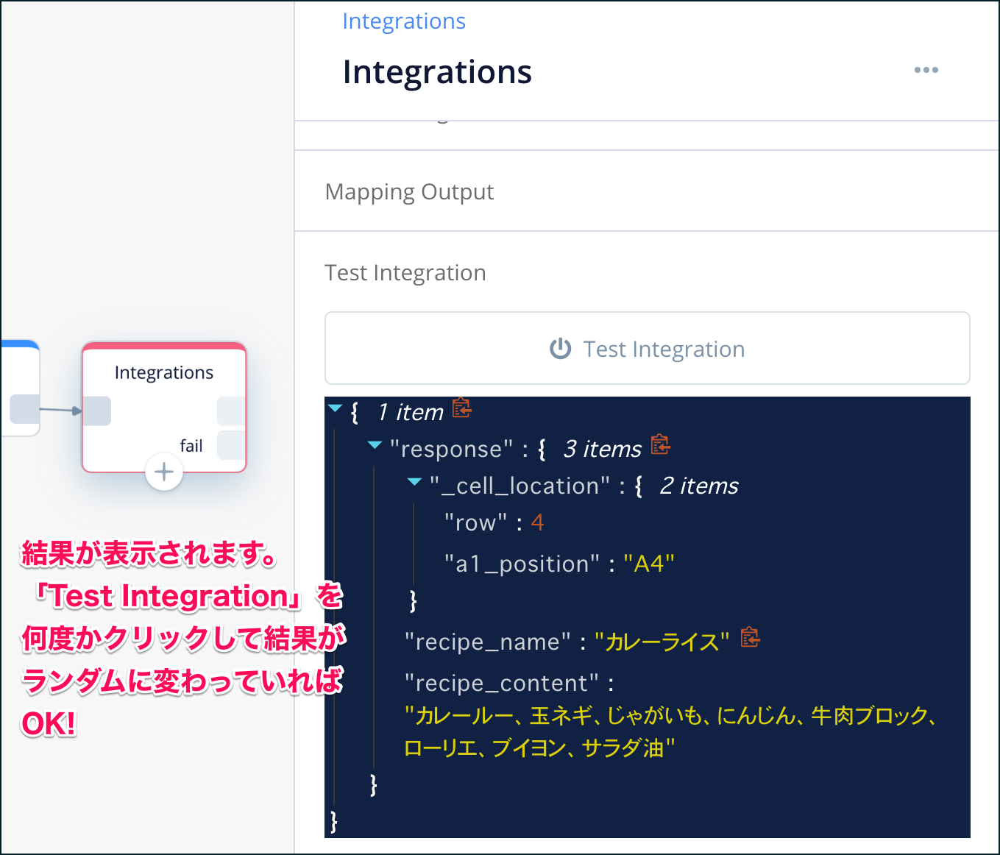

### Use spreadsheet data in your skill using variables

You have linked with Google Spreadsheets, but you still can't use that data from within your skill. You need to use "variables" to use the data obtained from the spreadsheet in your skill. Let's create a variable first.

Create variables from the "Variables Menu". Click the icon at the bottom of the three vertical icons on the left of the screen to switch the menu. Enter the variable name in the input form just below "Create Variable" and press the ENTER key to create the variable. First, type ```varName``` and press ENTER.

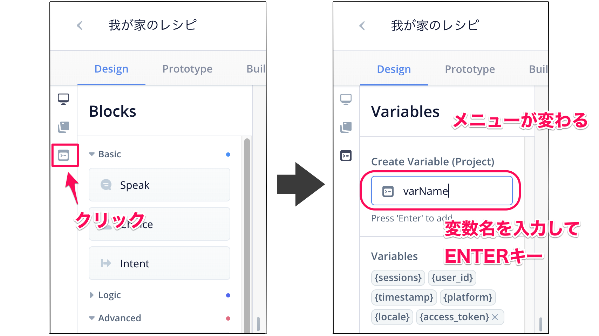

If ```varName``` is displayed at the end of``` sessions``` etc. displayed just below the input field, the variable has been successfully created. Similarly, create a variable called ```varContent```.

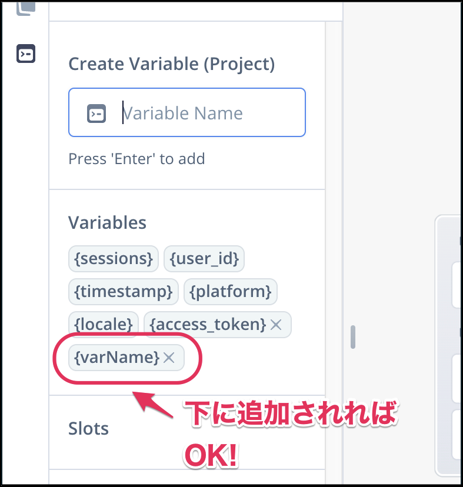

//embed[latex]{
\clearpage
//}

It is OK if two variables are created as shown below. Click the top icon of the three leftmost icons to return to the "Blocks menu".

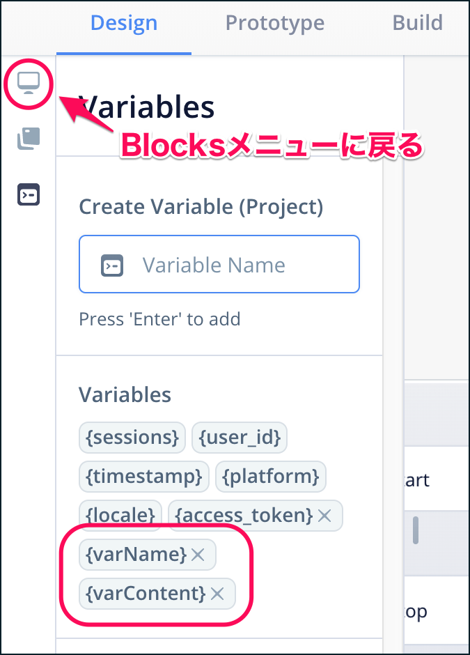

Next, link the data obtained from Google Spreadsheet with the variables. This allows the data contained in the variable (called the "value") to be called in other blocks. Click Integration Block to display the setting screen, then click "Mapping Output".

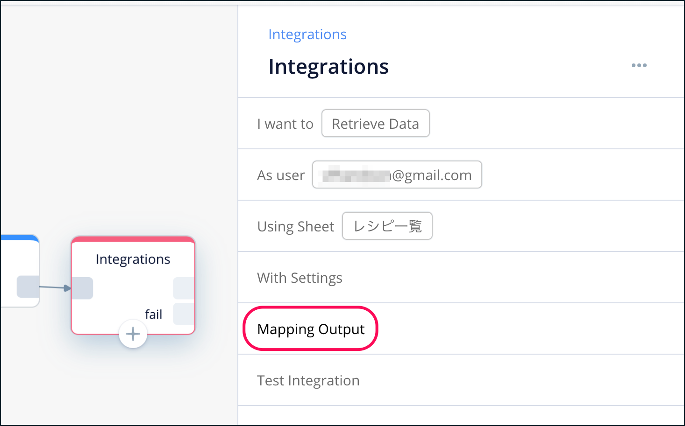

//embed[latex]{
\clearpage
//}

The link between the variable and the acquired data is done by "Mapping Output". Click "+ Add Mapping".

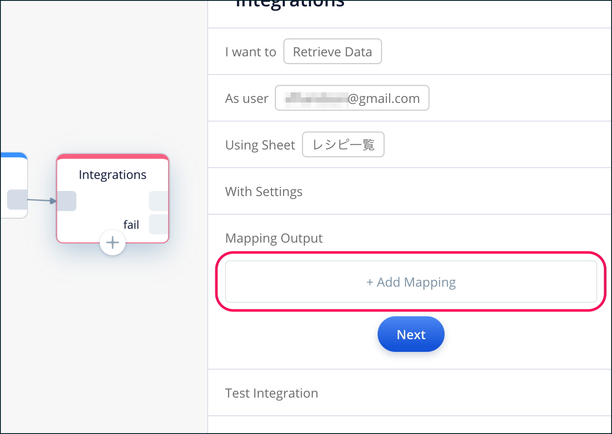

Click "+ Add Mapping" to select "Column" and "Variable" respectively. Specify the column name of the data obtained from the spreadsheet in "Column" and the variable name to associate it with "Variable". Now the spreadsheet data and variables are linked.


//embed[latex]{
\clearpage
//}

Now, let's link. Select ```recipe_name``` for" Column "and``` varName``` for "Variable".


The data in the ```recipe_name``` column of the spreadsheet is now in the variable``` varName```. Similarly, associate the ```recipe_content``` column with the variable``` varContent```. Click "+ Add Mapping" to add the settings in the same way.

It is OK if both can be linked and look like this. Click Next to return to the canvas.

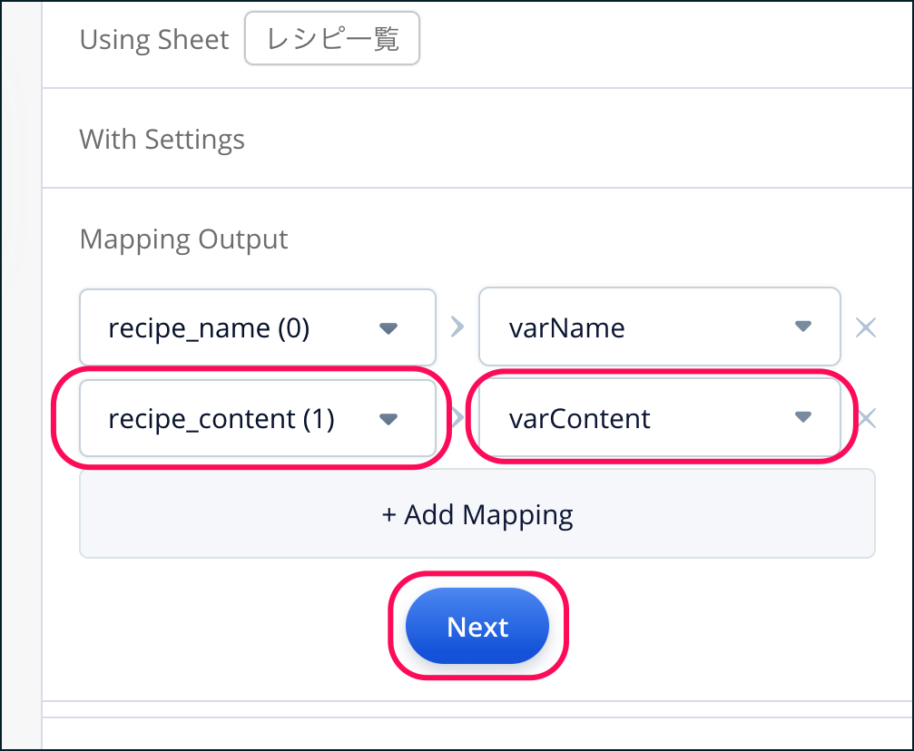

//embed[latex]{
\clearpage
//}

Now, let's use the data obtained from the spreadsheet from within the skill. Place a Speak block next to the Integration block, and connect it to the Integration block that doesn't say "fail".


Set the Speak block as follows.

```
{varName}. The material is {varContent}.
```

Let's test it by uploading it to the Alexa Developer Console. It is OK if you can execute the skill several times to confirm that the data of Google Spreadsheet has been obtained and that the data changes randomly.


//embed[latex]{
\clearpage
//}

### In case the Integration block fails

Although it is a very convenient Google spreadsheet integration, spreadsheets may not be accessible or data may not be obtained due to communication failure or misconfiguration. Let's do error handling properly.

Place the Speak block next to the Integration block and connect it to the Integration block's "fail".

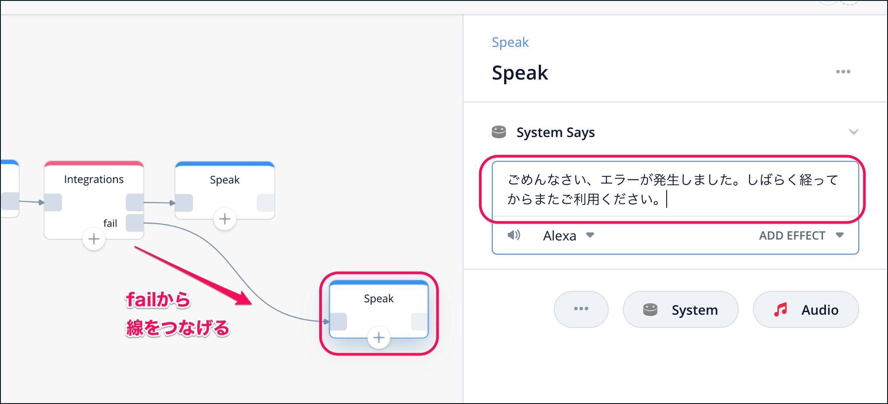

Set the Speak block as follows.

```
Sorry, an error has occurred. Please use again after a while.
```

Now, if an error occurs when linking with Google Spreadsheet, this Speak block will be executed.

## Get spreadsheet data by specifying conditions.

Next, let's search by specifying conditions. Ask the user which recipe they want to know, receive the utterance, and search the spreadsheet. @ <br> {}

### Receive user utterances as search criteria

Since we need to receive the user's utterance, we will change the flow slightly. First, modify the contents of the first Speak block.

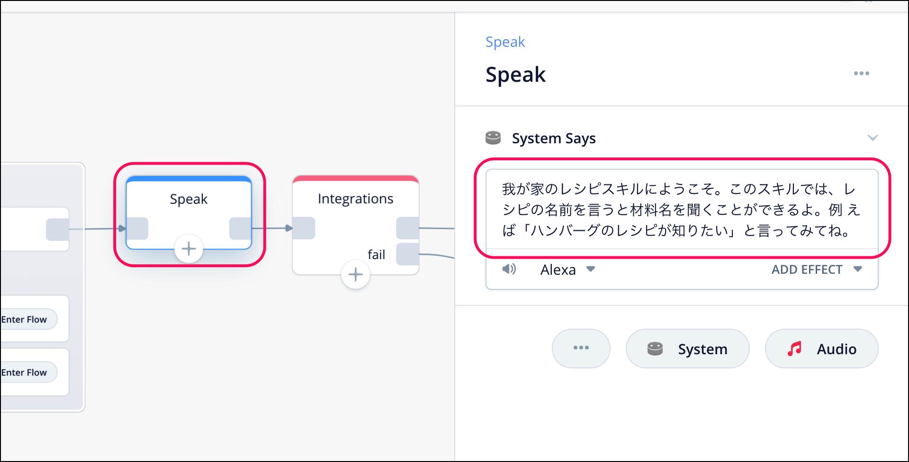

```
Welcome to our recipe skills. With this skill, you can ask the name of the ingredients by saying the name of the recipe. For example, say, "I want to know hamburger recipes."
```

Add a Choice block and a Speak block between the first Speak block and the Integration block, and connect them as shown below.

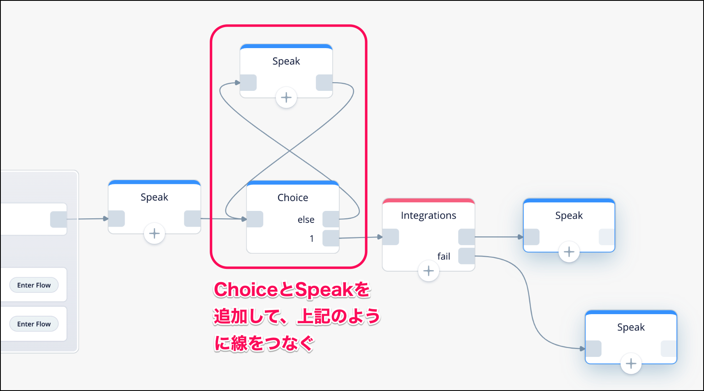

//embed[latex]{
\clearpage
//}

Let's make intent / sample utterance / slot. Click the Choice block to create an intent first. Enter ```ask_recipe_intent` in the" Name new intent or selecting existing intent "and click" Create ". This will be the intent name.

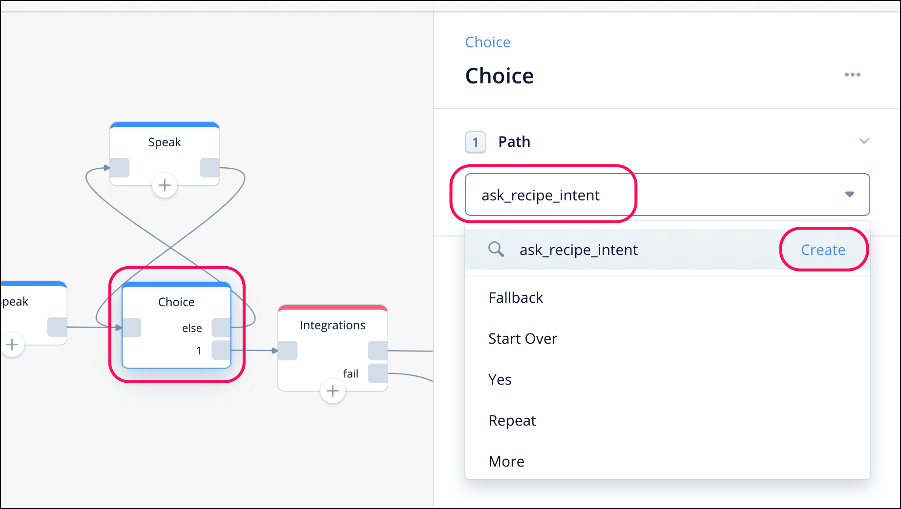

A new section called Utterances appears. Register the sample utterance here. In the "What might the user say to invoke this intent?" Field, enter ```I want to know the recipe for slot_recipe_name```. Don't forget to put a space between ```slot_recipe_name``` and``` I want to know the recipe```.

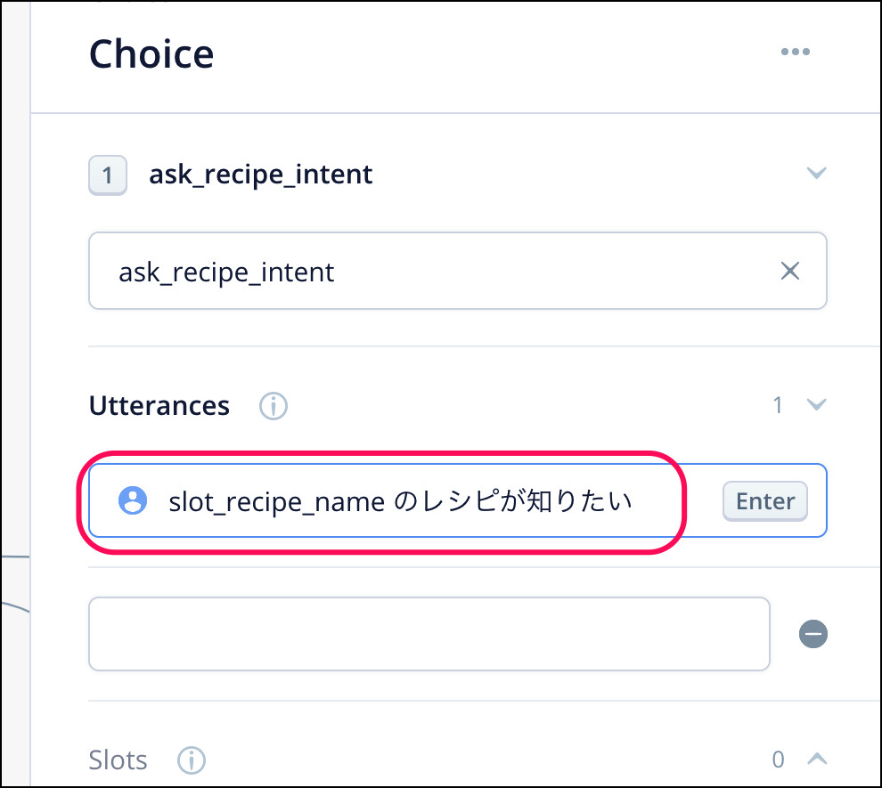

//embed[latex]{
\clearpage
//}

Next, select the ```slot_recipe_name``` part with the cursor, and it will be displayed as follows. Click" Create ".

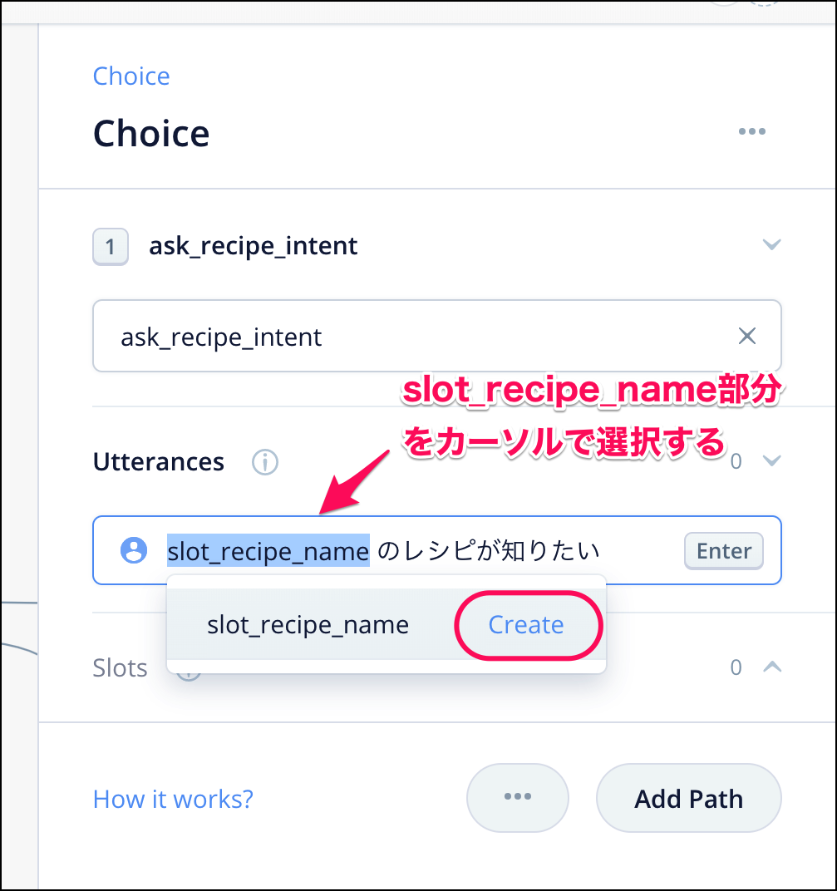

The slot creation screen is displayed. ```Slot_recipe_name``` selected earlier will be the slot name. Select “Food” for Slot Type and choose your favorite color for Slot Color. Finally, click "Create Slot". You have now created a slot.

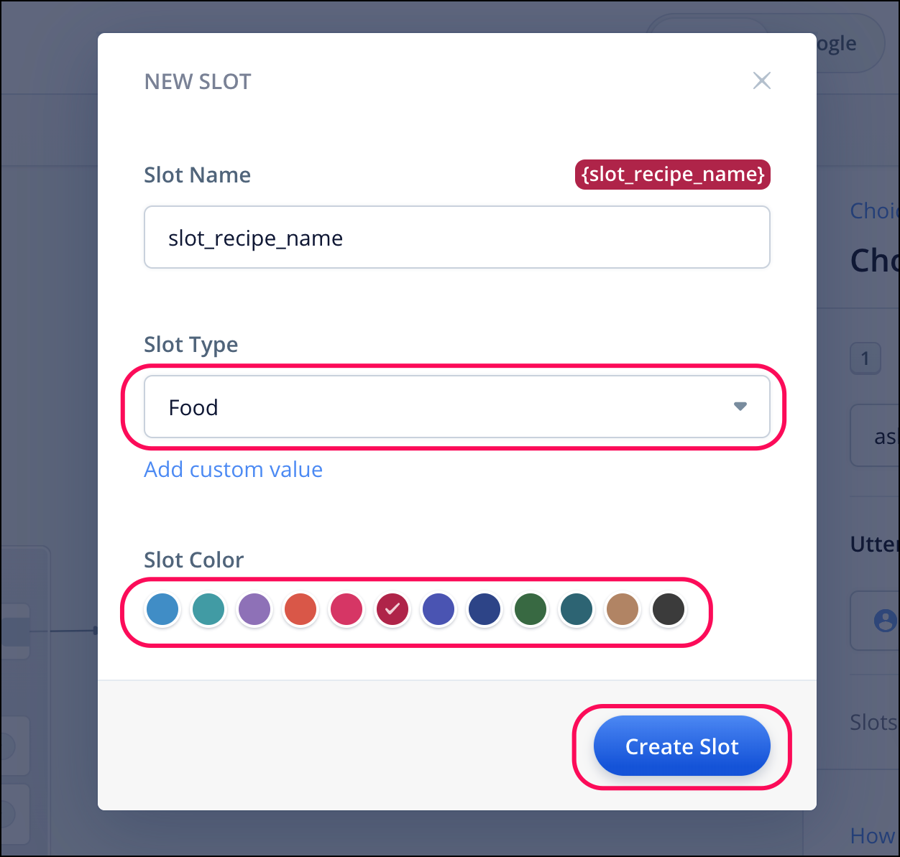

//embed[latex]{
\clearpage
//}

When you return to the Choice block setting screen, the sample utterance ```slot_recipe_name``` has changed to the specified color. In this way, sample utterances including slots are created. Finally, don't forget to click the ENTER key to register as a sample utterance.


If the sample utterance above is displayed below the input field, the sample utterance has been registered. Next, let's add a variation of the sample utterance. ```Please tell me the recipe of slot_recipe_name` and enter```.


//embed[latex]{
\clearpage
//}

As before, select ```slot_recipe_name``` with the cursor. ```Slot_recipe_name``` is already registered, so just select it from the list.


It is also possible to select a slot by inputting ```{``` when inputting a sample utterance, and then continue inputting. Register some sample utterances in your preferred way.


```
Sample utterance example:

I want to know the ingredients of {slot_recipe_name}
Tell me the ingredients for {slot_recipe_name}
{slot_recipe_name} recipe
{slot_recipe_name} ingredients
{slot_recipe_name}
```

//embed[latex]{
\clearpage
//}

It is OK if it finally feels like this.


The above Speak block is used to listen again if an utterance that does not correspond to the intent set in the Choice block is received.


Make the following entries:

```
I'm sorry, I didn't hear well. For example, say "I want to know hamburger recipes".
```

//embed[latex]{
\clearpage
//}

### Get spreadsheet data by specifying conditions

You are ready to receive user utterances as search criteria. Let's search the spreadsheet based on the utterance. Click the Integration block and click With Settings.


In the case of random, left side "Row Number" was selected, right side "Value to Match" was empty. Select "recipe \ _name" on the left and ```{slot_recipe_name}``` on the right, as shown below. This means that you can search by specifying what you spoke with the variable ```slot_recipe_name``` in the" recipe \ _name "column. Click “Next”.


//embed[latex]{
\clearpage
//}

Click Next for Mapping Output, go to Test Integration, and click Test Integration.


A screen different from the random case came out. Enter "curry rice" in ```slot_user_recipe``` and click" Run ".


//embed[latex]{
\clearpage
//}

You can get curry and rice data properly. In this way, if you use a variable as a search condition in "With Settings", you can test by specifying the value of the variable yourself. Search by another recipe name and confirm that data that meets the conditions can be obtained.


It works correctly on the Alexa Developer Console.


//embed[latex]{
\clearpage
//}

### Processing when there is no search result

Continuing from the previous test, try this time with a recipe name that is not registered in the recipe data.


```undefined``` means" nothing defined ". Not surprisingly, Alexa wouldn't return such an answer, as we tried to find a recipe name that wasn't in the recipe data. Let's fix it a little.

Delete the line of the Integration block and the line of the Speak block (the one that is not fail) when the Integration block succeeds, and place an If block under Logic in the Block menu to connect it. Set the Speak block aside a little.


//embed[latex]{
\clearpage
//}

The If block is a block that specifies a condition and branches the processing flow according to the result. Here, branching is performed when data can be searched from the recipe name in the Integration block and when data cannot be searched.


Let's set the conditions. Simply thinking, the variable ```varName` '' or the variable``` varContent` '' containing the data obtained from the spreadsheet is ```undefined` '', so use the equal I think it should be compared. However, this ```undefined``` is a little special programmatically, and it does not work even if it is set as follows.


//embed[latex]{
\clearpage
//}

So, twist it a little and try not to judge whether it is ```undefined```, but to judge whether the search result is done properly. First, select "` `slot_user_recipe``` for" Select Variable "at the top.

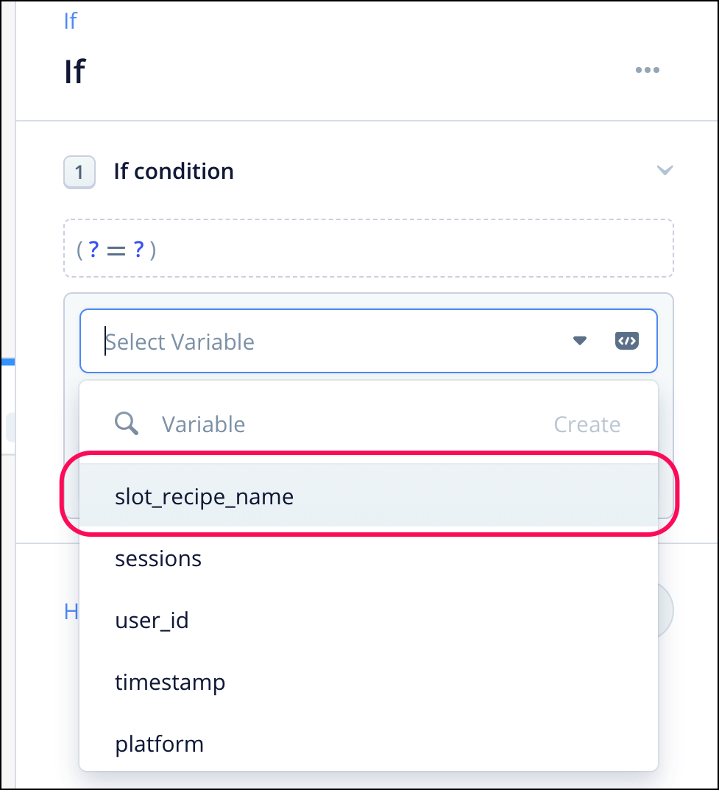

Next, as for "Value" on the lower side, in the initial state, you can only enter the value directly and you can not select the variable. Then, click the ```</>``` icon on the far right. Then a menu is displayed. Click "Variable".


//embed[latex]{
\clearpage
//}

Then, the lower side also changes to "Select Variable", so select ```varName```.

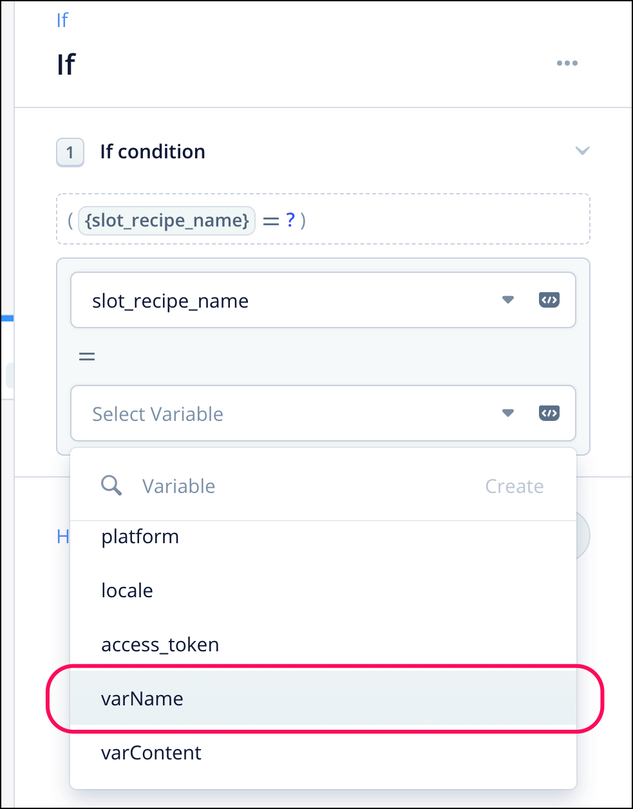

In other words, the check is that if the recipe name spoken by the user (```slot_user_recipe```) = the recipe name obtained from the spreadsheet (``` varName```), the search results could be obtained. . If this condition is met, the flow branches to "1". Otherwise, that is, to the flow "else" if it cannot be acquired, the flow branches.

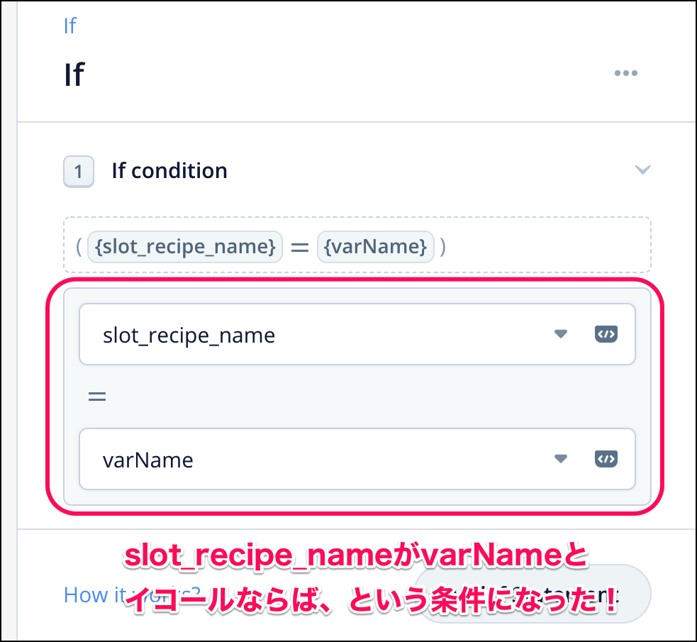

//embed[latex]{
\clearpage
//}

Let's tell Alexa each result in a Speak block. Connect the original Speak block to "1" of the If block. The content of the utterance is changed a little.

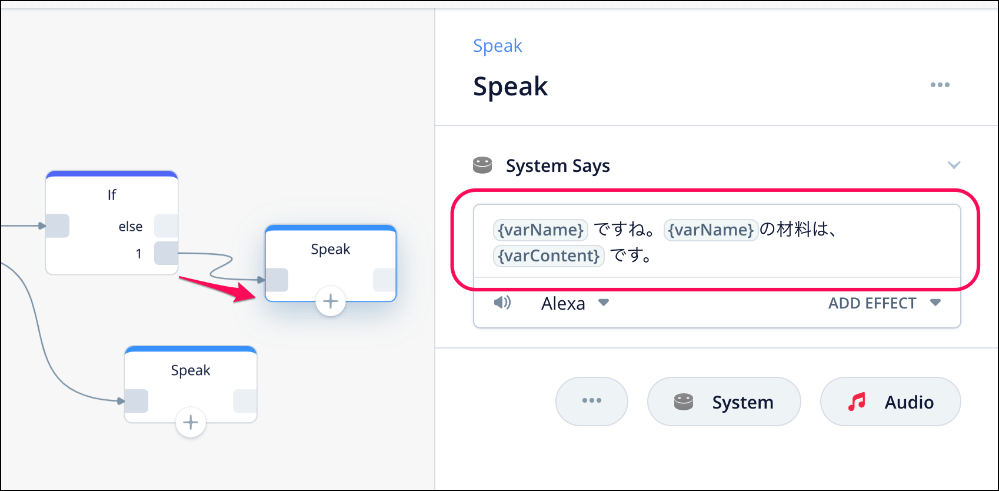

Add another Speak block, connect it from the "else" of the If block, and set as follows.

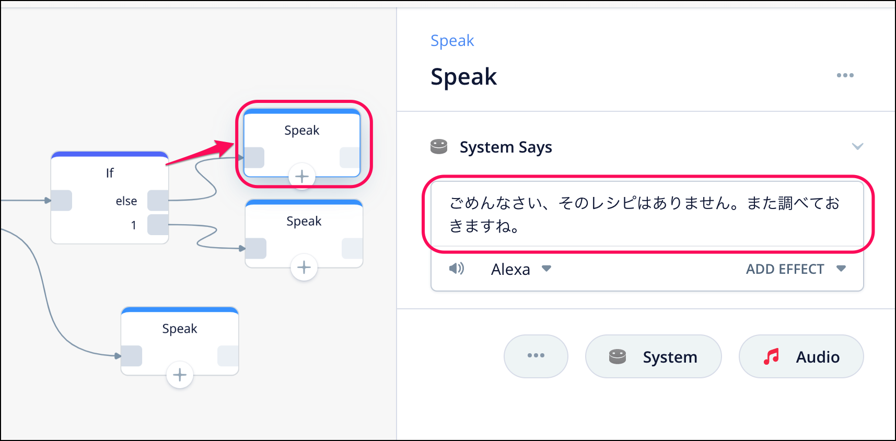

//embed[latex]{
\clearpage
//}

Finally, test it on the Alexa developer console, and if you can speak out if you can not get the result properly, you are done. Thank you

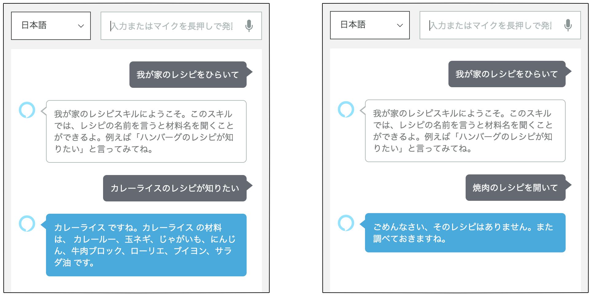

// note [judgment of undefined] {
Of course you can also determine undefind straight. Voiceflow's If block has a description method called Advanced Expression, which can be determined by programmatic writing. If you are used to programming, this may be easier to understand. See also the official documentation. @ <br> {}

Advanced expression (IF and SET blocks)-Voiceflow Docs @ <br> {}
@ <href> {https://docs.voiceflow.com/voiceflow-documentation/logic-in-voiceflow/advanced-expression-if-and-set-blocks}
//}

//embed[latex]{
\clearpage
//}

## Notes on using Google Spreadsheet

It is easy and convenient to use Google Spreadsheets, but it has some weaknesses.

- My personal impression is that accessing Google spreadsheets is a bit slower than accessing general APIs. Keep in mind that repeated access to a spreadsheet in a skill may impair the tempo and rhythm of the user's use of the skill.
- Also, frequent access to Google Spreadsheets may be restricted by Google. This should be fine for general skill use, but be aware that if your skill becomes popular, you may be subject to this restriction.
- If a large amount of data exists in the Google spreadsheet (such as a large number of rows or columns, or a large number of characters in a cell), the response may be slow or data may not be obtained. It depends on the combination of rows, columns, data in cells, etc., so it cannot be said unconditionally, but at most we recommend keeping it to less than 1000 rows.
- When searching with Google Spreadsheet, you can specify only one search target column. Note that you cannot execute complex search conditions like you would do with a general database.

If you meet the above restrictions or are not functional enough with Google Spreadsheets, we recommend using a full-fledged database such as Airtable or Firebase.

- Airtable (@ <href> {https://airtable.com/})
- Firebase (@ <href> {https://firebase.google.com/})

## Finally

What do you think. When you read data using Google Spreadsheets, you get a database-like atmosphere. This time, only the data reference was introduced for the convenience of the magazine, but of course it is also possible to register / update / delete the data in the spreadsheet. For more information, see the following site. Also, besides Google Spreadsheet integration, there are many Voiceflow tips, so please take a look. @ <br> {}

- Voiceflow Summer Holiday Advent Calendar @ <br> {}
@ <href> {https://qiita.com/kun432/items/666ae13f097004ea7935}
