# How to get started with Voiceflow
For beginners who want to use Voiceflow, it is a chapter where you can learn "What is Voiceflow" and "How to create a voice application using Voiceflow". Let's actually move your hand while reading.

## Introduction

### About Voiceflow
This service allows you to design and create voice applications (Alexa skills, Google actions, etc.) without coding. Even beginners can easily start using visual programming that is easy to understand visually.
// blankline
[https://www.voiceflow.com/](https://www.voiceflow.com/)
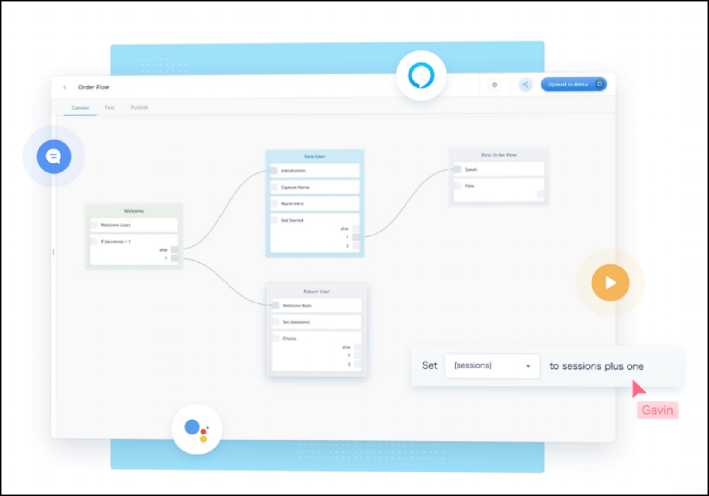

As of January 1, 2020, Voiceflow users have expanded to more than 21,000 people in more than 50 countries and are being used worldwide.

### About the product
Three types of products are available. The contents of each are described below.

- Alexa Skills
You can create Alexa skills without coding. Also, 5% of the world's Alexa skills are made from Voiceflow. (Alexa skills are functions and services that can be used with the Alexa, an AI assistant developed by Amazon.)
- Google Actions
You can create Google Actions without coding. (Google Action is a function or service that can be used with the Google Assistant (Assistant), an AI assistant developed by Google.)
- IVR (BETA)
You can create the latest IVR system without coding. Modern IVR technology must be easy to design, prototype, and repeat. It helps you find what you are looking for quickly, reduce operating costs and increase customer loyalty. With Voiceflow you can build your skills faster.

### About rate plans
Four types of plans are available, and contracts can be made on a monthly or yearly basis. For personal use, you can develop a free "BASIC" plan. Each content is described below.
(As of January 1, 2020, the rate plan has been revised several times)

- BASIC
You can create unlimited projects for free and use all the core features.
- PROFESSIONAL
Multiple people can collaboratively develop voice applications. In addition, all products can be used and unlimited backups can be given priority support.

//embed[latex]{
\clearpage
//}

- TEAM
In addition to the functions of PROFESSIONAL, you can create an unlimited number of workspaces. In addition, there is dedicated support.
- ENTERPRISE
The plan to choose when you need larger requirements. Contact us for more information

[https://www.voiceflow.com/pricing](https://www.voiceflow.com/pricing)
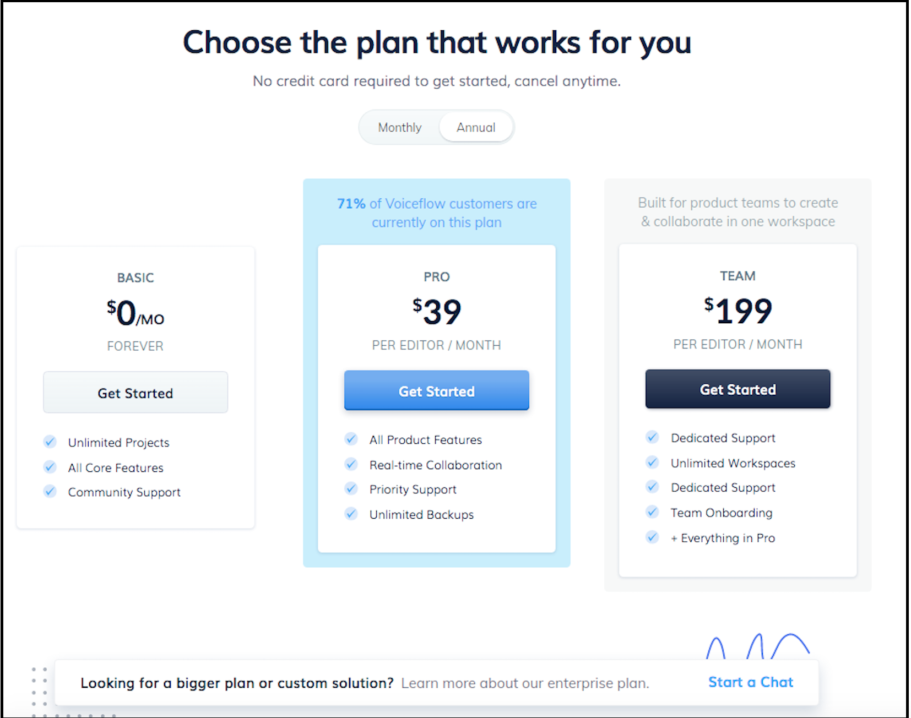

### About the documentation
Documents are explained in an easy-to-understand video format. Please refer to "Get started" at the following URL. What is explained in the video is summarized in [Video description] below.

- Documentation
[https://docs.voiceflow.com/home/get-started-with-voiceflow/](https://docs.voiceflow.com/home/get-started-with-voiceflow)

- Tutorial
[https://learn.voiceflow.com/en/collections/1499932-learn-the-basics#getting-started](https://learn.voiceflow.com/en/collections/1499932-learn-the-basics# getting-started)

#### [Video commentary]
[https://www.youtube.com/channel/UCbqUIYQ7J2rS6C_nk4cNTxQ](https://www.youtube.com/channel/UCbqUIYQ7J2rS6C_nk4cNTxQ)@   {}

In addition, opinions are actively exchanged below, so please use them together.

- Forum
[https://forum.voiceflow.com/](https://forum.voiceflow.com/)

- Facebook
[https://www.facebook.com/groups/voiceflowgroup/](https://www.facebook.com/groups/voiceflowgroup/)

- Voiceflow Japan User Group
[https://www.facebook.com/groups/vfjug/](https://www.facebook.com/groups/vfjug/)

## How to use Voiceflow
This section describes how to create an account, how to create a voice application, and how to check the operation.

- Create account
- Screen description
- Basic block description
- Creation procedure
- Operation check
- Procedure for creating the next and subsequent projects

### Create an account
Open the following URL and click the "Sign Up" button on the upper right.
[https://www.voiceflow.com/](https://www.voiceflow.com/)
// blankline
Enter your name, email address and password to sign up.
Voiceflow allows you to socially log in with "Google" and "Facebook", so users can sign up from there. After that, you can use it by answering some questionnaires.
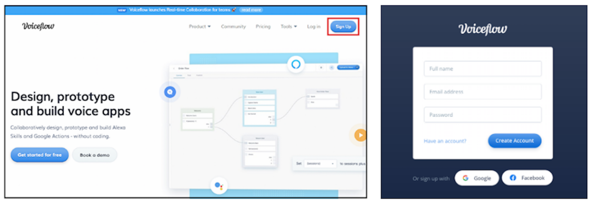

### Screen description
Drag the blocks from the Blocks menu on the left and drop them on the Design on the right to create a voice application.

### "Basic" Function Block Description
Describes the blocks of the "Basic" function. A simple voice application can be created with only the following two blocks.

- Speak Block

> Speak Block allows Alexa to talk to users in different voices and play audio files.

//embed[latex]{
\clearpage
//}

- Choice Block

> Define user utterances and branches in the Choice Block. When the user speaks one of the options in the utterance list, it follows the path of that option. Follow the ELSE pass when the user talks about not being an option.

### Creation procedure
Now, we will explain the creation procedure. Drag and drop the Speak Block and enter the text on the setting screen on the right.
If you can, connect the blocks together.
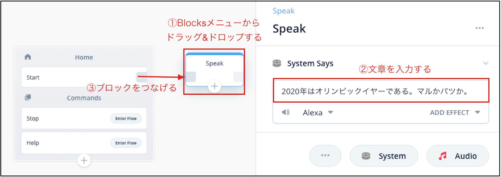

Next, drag and drop the Choice Block and enter the Intent name, “Mul” and “X” on the setting screen on the right.
If possible, connect with Speak Block.
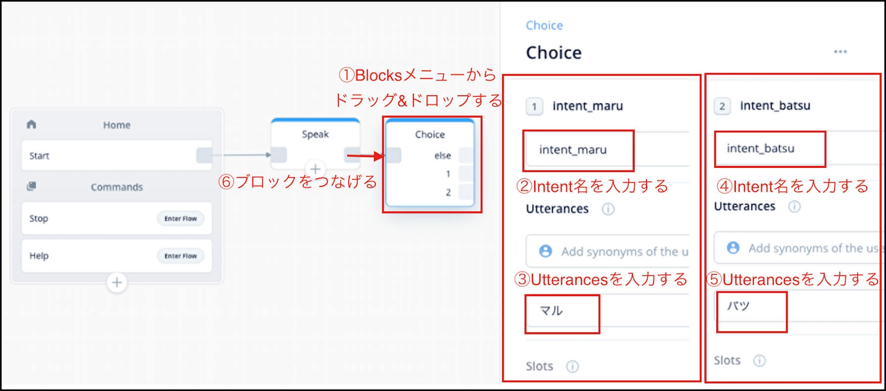

//embed[latex]{
\clearpage
//}

Finally, drag and drop two Speak Blocks, and enter the text on the setting screen on the right.
If you can, connect with Choice Block.

 
### Operation check
Let's move the created one and check it. You can check the operation on Voiceflow. Go to the "Prototype tab" and click the "Start Test" button.

//embed[latex]{
\clearpage
//}

When the user selects each of "Maru" and "X", you can see that the responses are different.

### Next project creation procedure
Return to the list screen, create from "Create Project" at the bottom of the screen.
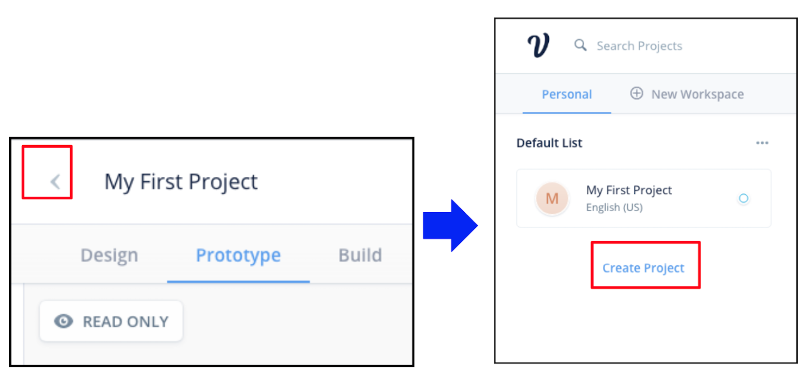

//embed[latex]{
\clearpage
//}

Enter a project name, check Japanese and create a project.
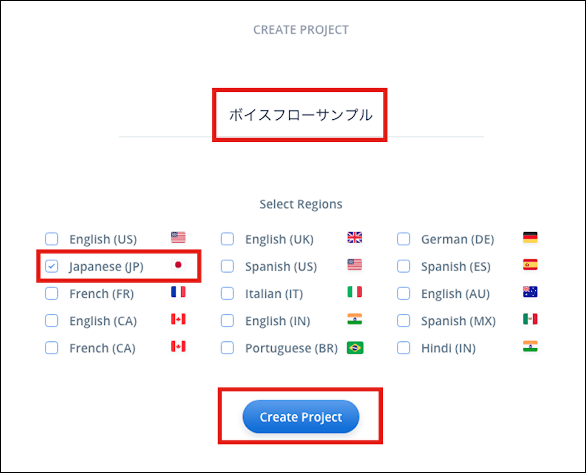

## upload
After uploading, you can check the operation on each platform. Details are described in other chapters. Alexa skills require an Alexa development account. Please refer to the following URL for details.
[https://dev.classmethod.jp/voice-assistant/how-to-safety-create-alexa-developers-account/](https://dev.classmethod.jp/voice-assistant/how-to-safety -create-alexa-developers-account /)
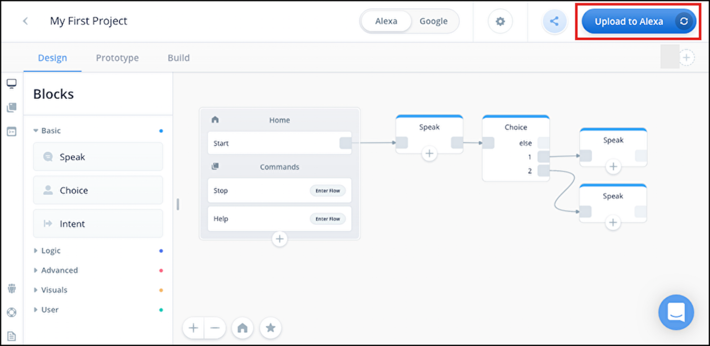

## supplement
### How to erase lines connected to blocks
If you mistakenly connect the lines of the block, you can erase the lines in the following two ways.

1. Click the gray square of the block on the left
2. Move the cursor to the line and click the trash can mark

### Copy (delete) blocks
If you need a similar block (if you no longer need the block), you can copy (delete) the block in the following two ways.

1. Right-click on the block you want to copy and click Copy Block. (To delete the block, click "Delete Block".) Right-click in an empty space and click "Paste."
2. Click the block you want to copy and press "Ctrl / Command + C" on your keyboard. Then press "Ctrl / Command + V". (Press "Del" to delete the block.)

### Change the order of items in the block
Drag the item you want to change and drop it where you want to change. You can change the order of utterances and sound effects with Speak Block etc.
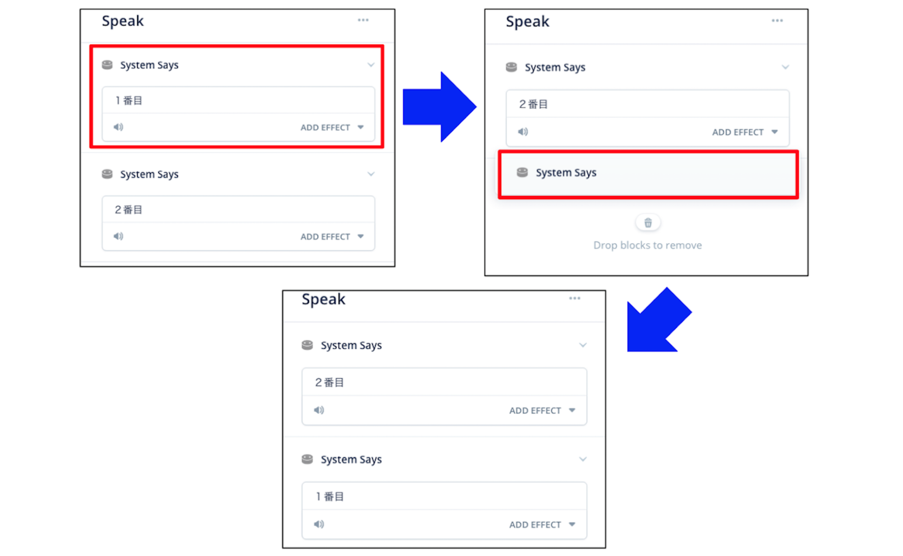

### How to delete items in a block
Drag the item you want to delete and drop it on the trash. Unnecessary items can be deleted with Speak Block etc.
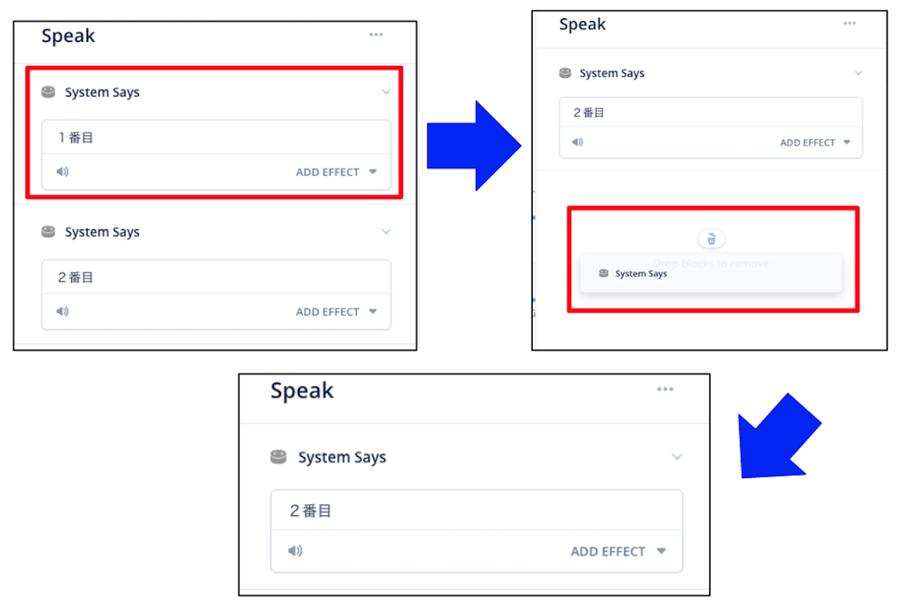

### Share project
Click the Share Test button to get the link from "Share testable link". By sharing this link with others, you can check the operation of the created project.
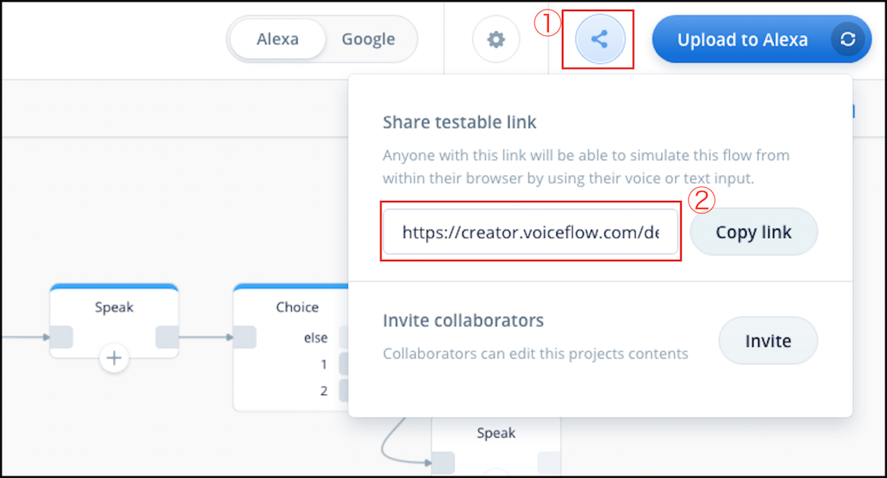

### Download the project
Click the setting button on the upper right and get the link from "Downloadable link". Share this link with others to download your project.

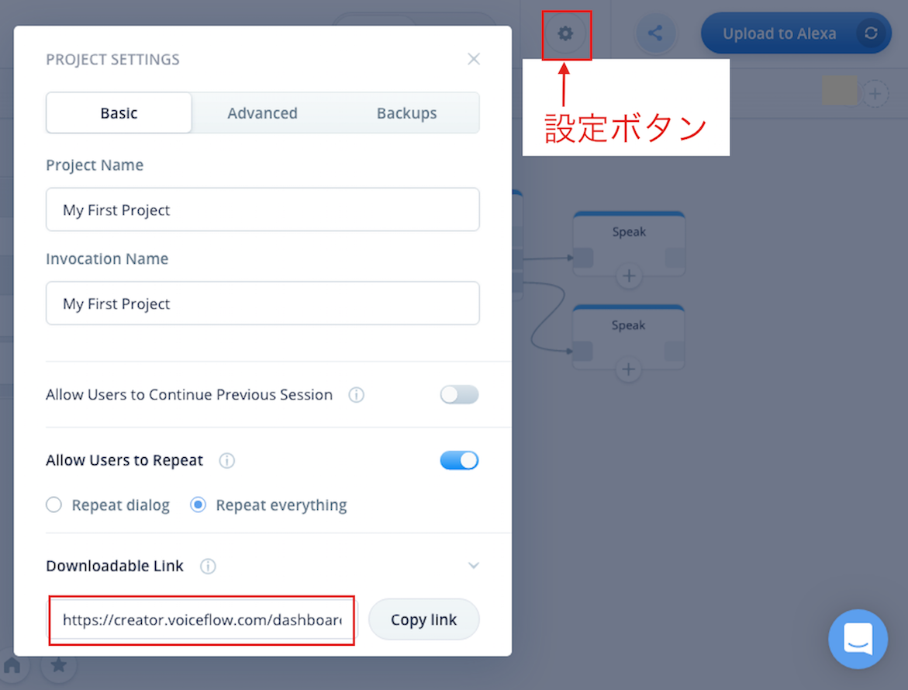

### Useful settings to know
- Change project name
You can change the "Display Name" and "Invocation Name" by clicking the settings button in the upper right corner.

- Unlink account
To reset the account link between Amazon and Google, first select "Account" from the account name at the top right of the list screen, and click each "Reset". Then, when uploading the skill, please link the account correctly.

### Support function
If you can't figure out what you're looking at, you can ask a Voiceflow member a question from the balloon at the bottom right.
It will be in English. There is a time difference, but you can get a reply immediately during business hours.
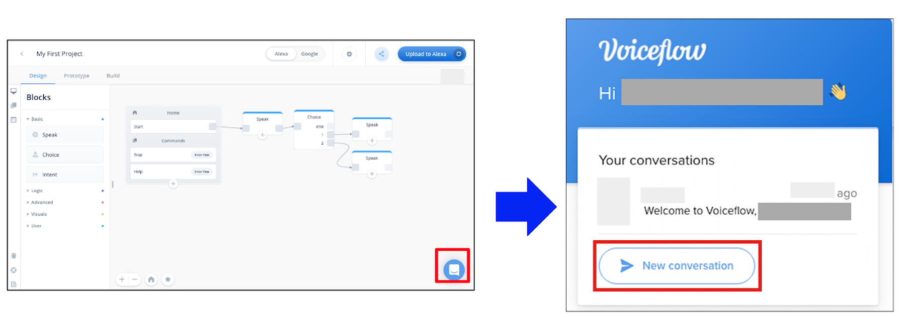

### Operation status
You can check the operation status of Voiceflow. If it is green, it is working properly. Please check if there is a problem.

[https://status.voiceflow.com/](https://status.voiceflow.com/)

## in conclusion
I collected information about Voiceflow for beginners. What did you think. With Voiceflow features, you can do what you want relatively easily. By all means, please consider various uses, and I hope that this chapter will be a little helpful at that time.
